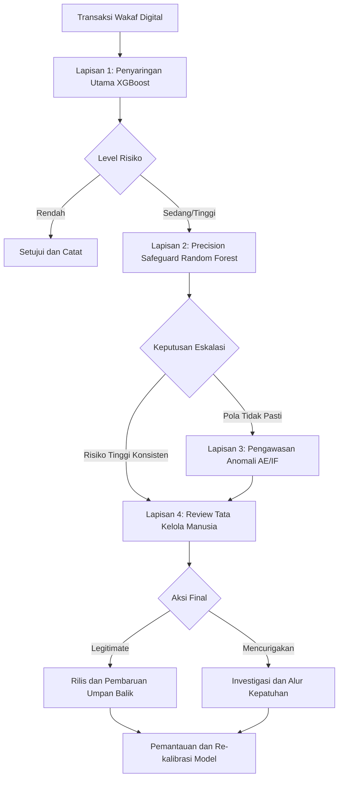

# Meningkatkan Kepercayaan pada Platform Wakaf Digital melalui Deteksi Fraud Berbasis Machine Learning

## Abstrak
Platform wakaf digital meningkatkan aksesibilitas, transparansi, dan efisiensi, tetapi juga meningkatkan paparan terhadap fraud transaksi yang dapat melemahkan kepercayaan donatur serta kredibilitas institusi. Studi ini mengembangkan kerangka deteksi fraud berbasis machine learning menggunakan alur kerja CRISP-DM dan mengevaluasinya pada skenario proksi dengan ketidakseimbangan kelas yang ekstrem. Empat model dibandingkan: Random Forest, XGBoost, Isolation Forest, dan Autoencoder. Pada evaluasi holdout terkalibrasi, XGBoost mencapai keseimbangan keseluruhan terkuat (Precision 0.927711, Recall 0.810526, F1 0.865169, ROC-AUC 0.975017, PR-AUC 0.822634), sedangkan Random Forest mencapai precision tertinggi (0.985507) dengan jumlah false positive terendah (1). Untuk meningkatkan reliabilitas melampaui satu pembagian data, dilakukan repeated stratified cross-validation (5 fold x 3 seed, 15 run per model) dan pengujian statistik berpasangan. Cross-validation mengonfirmasi stabilitas peringkat (rata-rata F1 XGBoost 0.846980 +/- 0.022275; rata-rata F1 Random Forest 0.834087 +/- 0.043353). Uji Welch menunjukkan tidak ada perbedaan F1 yang signifikan antara XGBoost dan Random Forest (p = 0.317325), sementara keduanya secara signifikan mengungguli model unsupervised (p < 0.001). Temuan mendukung desain tata kelola berlapis untuk wakaf digital: deteksi supervised sebagai penyaringan utama dan model anomali sebagai pengawasan sekunder. Karena dataset yang digunakan adalah proksi non-wakaf dengan fitur teranonimisasi, klaim penelitian bersifat metodologis dan berorientasi tata kelola, bukan bukti langsung penerapan operasional.

Kata kunci: wakaf digital, deteksi fraud, machine learning, CRISP-DM, tata kelola fintech

---

## 1. Pendahuluan
Transformasi digital dalam pengelolaan wakaf dapat meningkatkan akuntabilitas dan jangkauan operasional. Namun, transaksi digital juga menciptakan risiko fraud yang dapat merusak kepercayaan antara donatur, pengelola, dan penerima manfaat. Pada sistem transaksi bervolume tinggi, pemantauan manual tidak memadai, terutama ketika kejadian fraud bersifat langka.

Machine learning dapat mendukung deteksi fraud pada kondisi ketidakseimbangan kelas yang berat, tetapi dataset fraud khusus wakaf yang bersifat publik belum tersedia. Oleh karena itu, penelitian ini menggunakan dataset fraud proksi untuk membangun baseline metodologis yang reprodusibel serta interpretasi tata kelola bagi platform wakaf digital (Oduro et al., 2025; Vangibhurathachhi, 2025; Phua et al., 2010).

Makalah ini memberikan tiga kontribusi terintegrasi. Pertama, penelitian ini mengimplementasikan pipeline CRISP-DM end-to-end dengan artefak yang reprodusibel. Kedua, penelitian ini melakukan evaluasi komparatif model deteksi fraud supervised dan unsupervised dalam satu alur kerja yang konsisten. Ketiga, penelitian ini memperkuat kredibilitas empiris melalui repeated stratified cross-validation dan uji signifikansi statistik berpasangan.

Studi ini dipandu oleh tiga pertanyaan penelitian. RQ1 menanyakan model mana yang memberikan trade-off precision-recall paling andal untuk deteksi fraud pada dataset proksi dengan ketidakseimbangan ekstrem untuk konteks wakaf digital. RQ2 menelaah apakah deteksi anomali dapat melengkapi supervised learning dalam arsitektur pemantauan fraud berlapis. RQ3 menyelidiki bagaimana keluaran model dapat diterjemahkan ke dalam kerangka tata kelola dan kepercayaan terapan untuk platform wakaf digital.

Untuk memosisikan kontribusi tersebut, bagian berikut terlebih dahulu menempatkan studi ini dalam literatur yang ada, kemudian memetakan konteks empiris dan desain metodologis.

---

## 2. Tinjauan Pustaka dan Posisi Kebaruan

Bagian ini memosisikan studi terhadap literatur deteksi fraud sebelumnya dan secara eksplisit menyatakan apa yang baru dalam naskah ini.

### 2.1 Penelitian Terdahulu dalam Deteksi Fraud Keuangan
Dua referensi inti yang tersedia pada proyek ini menekankan kekuatan AI/ML untuk deteksi fraud keuangan. Oduro et al. (2025) membahas deteksi fraud berbasis AI pada perbankan digital melalui pendekatan tinjauan pustaka dan menyoroti supervised learning, deteksi anomali, explainability, serta isu tata kelola. Vangibhurathachhi (2025) menyajikan pendekatan supervised, unsupervised, dan deep learning untuk deteksi fraud transaksi keuangan dengan penekanan pada skalabilitas, deteksi real-time, dan tantangan implementasi.

Pada kedua referensi tersebut, kesimpulan umumnya adalah machine learning secara umum mengungguli sistem berbasis aturan statis untuk lingkungan fraud digital modern (Oduro et al., 2025; Vangibhurathachhi, 2025).

### 2.2 Identifikasi Kesenjangan
Berdasarkan referensi yang tersedia, terdapat empat kesenjangan praktis dalam konteks fintech wakaf saat ini. Pertama adalah kesenjangan domain, karena penelitian sebelumnya berfokus pada perbankan digital dan sistem keuangan umum, bukan skenario tata kelola wakaf digital. Kedua adalah kesenjangan reproduktibilitas, karena pembahasan pada dokumen yang disediakan sebagian besar bersifat konseptual atau tinjauan dengan artefak CRISP-DM end-to-end yang terbatas. Ketiga adalah kesenjangan evaluasi komparatif, karena pendekatan supervised dan unsupervised dibahas secara luas tetapi jarang dikalibrasi berdampingan dalam satu pipeline yang konsisten. Keempat adalah kesenjangan validasi statistik, karena repeated cross-validation dan uji signifikansi berpasangan bukan fokus utama pada referensi yang disediakan.

### 2.3 Kebaruan Penelitian Ini
Kebaruan studi ini bukan pada algoritma baru; kebaruan terletak pada desain yang berorientasi tata kelola dan reprodusibel untuk manajemen risiko wakaf digital. Secara kontekstual, studi ini mereframing deteksi fraud dari keamanan keuangan generik menjadi kebutuhan kepercayaan, transparansi, dan tata kelola yang spesifik pada platform wakaf. Secara metodologis, studi ini mengimplementasikan pipeline CRISP-DM lengkap dengan artefak yang dapat diaudit, termasuk tabel, plot, laporan, dan file model. Pada tingkat evaluasi, penelitian membandingkan Random Forest, XGBoost, Isolation Forest, dan Autoencoder dalam satu alur kerja terkalibrasi yang selaras dengan tujuan operasional. Untuk validasi, penelitian menambahkan repeated stratified cross-validation (5 fold x 3 seed) dan pengujian statistik berpasangan. Pada tingkat desain implementasi, penelitian mengusulkan pemakaian tata kelola berlapis, dengan model supervised untuk penyaringan utama dan model anomali untuk pengawasan sekunder.

### 2.4 Ringkasan Posisi Komparatif

| Dimensi | Referensi Sebelumnya (Tersedia dalam Proyek) | Penelitian Ini |
|---|---|---|
| Konteks utama | Perbankan digital / fraud keuangan umum | Konteks proksi tata kelola wakaf digital |
| Jenis studi | Mayoritas sintesis literatur/konseptual | Implementasi empiris CRISP-DM end-to-end |
| Perbandingan model | Diskusi luas pada level keluarga model | Perbandingan terpadu 4 model spesifik |
| Artefak reprodusibel | Bukan fokus pada cuplikan yang tersedia | Set artefak lengkap tersimpan di disk |
| Ketahanan statistik | Bukti repeated-CV eksplisit terbatas pada cuplikan yang tersedia | Repeated stratified CV + uji Welch berpasangan |
| Terjemahan tata kelola | Rekomendasi keamanan umum | Kerangka kepercayaan-transparansi-tata kelola untuk fintech wakaf |

Posisi ini menegaskan bahwa kontribusi makalah terletak pada evaluasi yang ketat, reprodusibel, dan interpretasi tata kelola spesifik domain, bukan pada pengusulan arsitektur ML baru.

### 2.5 Justifikasi Dataset (Mengapa Menggunakan Dataset Proksi)
Kekhawatiran reviewer terkait pemilihan dataset valid dan ditangani secara eksplisit. Dataset proksi digunakan karena dataset fraud transaksi wakaf tidak tersedia secara publik pada repositori riset terbuka, sehingga menghambat benchmarking yang transparan dan reprodusibel pada data native wakaf. Selain itu, mekanisme deteksi inti yang diteliti berkaitan dengan anomali perilaku dan pembelajaran pada data tidak seimbang, yang secara struktural dapat ditransfer lintas domain transaksi digital. Terakhir, dua referensi yang tersedia pada proyek ini juga berfokus pada konteks fraud keuangan non-wakaf, yang menunjukkan bahwa eksperimen pada domain proksi merupakan jalur empiris yang umum sebelum penerapan spesifik domain.

Karena itu, makalah ini memosisikan kesimpulan sebagai bukti transfer metode dan desain tata kelola, bukan sebagai klaim performa langsung untuk sistem produksi wakaf hidup.

Setelah batas kebaruan diklarifikasi, bagian berikut menjelaskan konteks penelitian dan profil data yang digunakan untuk mengoperasionalkan pipeline yang diusulkan.

---

## 3. Konteks Penelitian dan Data

Bagian ini mempersempit masalah dari kekhawatiran tata kelola konseptual menjadi karakteristik data terukur yang membentuk keputusan pemodelan.

### 3.1 Permasalahan Bisnis dan Tujuan Tata Kelola
Permasalahan inti adalah bagaimana mendeteksi transaksi digital yang mencurigakan sambil menyeimbangkan efektivitas pencegatan fraud, pengendalian false positive untuk menghindari friksi yang tidak perlu bagi donatur atau operator, serta akuntabilitas tata kelola berorientasi transparansi dalam operasi wakaf digital.

Dengan kebutuhan tata kelola tersebut, profil dataset berikut menjelaskan batasan empiris yang menjadi konteks interpretasi performa model.

### 3.2 Profil Dataset
Eksperimen menggunakan dataset fraud transaksi proksi yang berisi 284807 baris dan 31 kolom, dengan prevalensi fraud sebesar 0.001727. Pada tahap profiling, teridentifikasi 1081 record duplikat, sementara missing value tidak teramati pada profil missingness utama. Distribusi ini menegaskan pola kelangkaan kejadian fraud sebagaimana diharapkan dan membenarkan pilihan evaluasi yang peka terhadap ketidakseimbangan (He and Garcia, 2009; Saito and Rehmsmeier, 2015).

Setelah profil data ditetapkan, diagnostik visual disajikan untuk menunjukkan tingkat keparahan ketidakseimbangan dan hubungan antarfitur yang memotivasi strategi pemodelan.

### 3.3 Plot Data Understanding

Visualisasi ketidakseimbangan kelas:

Gambar 1. Distribusi kelas pada dataset proksi.

Penjelasan: Gambar 1 mengonfirmasi ketidakseimbangan berat antara transaksi legitimate dan fraud. Kondisi ini mendorong penggunaan PR-AUC, recall, dan F1 sebagai indikator utama, karena akurasi dapat menyesatkan ketika insiden fraud sangat rendah.

Perilaku jumlah transaksi per kelas:

Gambar 2. Distribusi nilai transaksi berdasarkan kelas.

Penjelasan: Gambar 2 menunjukkan adanya tumpang tindih rentang nilai antara fraud dan non-fraud. Ini mengindikasikan bahwa variabel amount saja tidak cukup untuk deteksi yang robust dan harus digabungkan dengan sinyal perilaku multivariat.

Peta korelasi fitur terpilih:

Gambar 3. Heatmap korelasi fitur terpilih dengan koefisien per sel.

Penjelasan: Gambar 3 menyajikan nilai korelasi numerik pada tiap sel untuk meningkatkan interpretabilitas. Sebagian besar hubungan berpasangan bersifat moderat, sehingga model sebaiknya menangkap interaksi non-linear alih-alih hanya mengandalkan ketergantungan linear yang kuat.

Dengan konteks empiris ini, bagian berikut merinci implementasi CRISP-DM yang digunakan untuk mentransformasikan pemahaman data menjadi pipeline deteksi fraud yang reprodusibel.

---

## 4. Metodologi (CRISP-DM)

Alur metodologis mengikuti desain bertahap agar setiap keputusan pemodelan dapat ditelusuri kembali ke karakteristik data yang teramati dan tujuan tata kelola.

### 4.1 Persiapan Data
Dataset dipraproses dengan menghapus 1081 record duplikat, sehingga tersisa 283726 baris untuk pemodelan. Seluruh 30 prediktor non-target dipertahankan karena tidak ada fitur yang melampaui ambang penghapusan berdasarkan missingness. Pembagian stratified 80:20 menghasilkan 226980 baris pelatihan dan 56746 baris validasi dengan tetap menjaga kelangkaan kelas (rasio fraud train: 0.001665; rasio fraud validasi: 0.001674). Pipeline praproses menerapkan imputasi median dan robust scaling, dan cabang unsupervised dilatih hanya pada transaksi normal. Untuk supervised learning, digunakan class-weighting (kelas 0: 0.5008340614822464; kelas 1: 300.23809523809524) sebagai alternatif yang sadar ketidakseimbangan dibanding resampling naif (He and Garcia, 2009; Chawla et al., 2002).

Berdasarkan persiapan tersebut, set model sengaja dipilih untuk membandingkan classifier berbasis label terhadap detector berbasis anomali dalam kondisi data yang identik.

### 4.2 Model
Set model komparatif mencakup Random Forest dan XGBoost untuk supervised learning, serta Isolation Forest dan detektor rekonstruksi berbasis autoencoder untuk pemantauan berorientasi anomali. Pemilihan ini secara sengaja menggabungkan classifier tabular yang kuat dengan detector unsupervised untuk mendukung deteksi pola berlabel sekaligus pengawasan anomali yang muncul (Breiman, 2001; Chen and Guestrin, 2016; Liu et al., 2008; Chandola et al., 2009).

Karena keluaran model sensitif terhadap ambang keputusan pada pengaturan data tidak seimbang, pemilihan threshold diperlakukan sebagai langkah desain eksplisit, bukan pengaturan default.

### 4.3 Strategi Threshold
Threshold dikalibrasi secara eksplisit, bukan dipatok pada nilai default. Random Forest menggunakan threshold 0.527 dengan tujuan prioritas precision, sedangkan XGBoost menggunakan threshold 0.415 dengan tujuan prioritas recall. Untuk model anomali, Isolation Forest menggunakan threshold 0.5769604030363915 dari persentil ke-99 skor anomali, dan autoencoder menggunakan threshold 0.8782194725058396 dari persentil ke-99 reconstruction error. Strategi kalibrasi ini konsisten dengan praktik terbaik pada pengaturan keputusan tidak seimbang, di mana pilihan threshold secara material memengaruhi trade-off operasional (Davis and Goadrich, 2006; Saito and Rehmsmeier, 2015).

Visualisasi kalibrasi:

Setelah kalibrasi selesai, bagian berikut melaporkan hasil performa secara bertingkat: metrik holdout, struktur error, perilaku kurva, robustness, dan signifikansi statistik.

---

## 5. Hasil

Hasil disusun secara progresif agar pembaca dapat bergerak dari performa utama ke bukti reliabilitas tanpa kehilangan kesinambungan metodologis.

### 5.1 Hasil Holdout (Validation Set Terkalibrasi)

Tabel 1 merangkum performa model pada holdout set yang telah dikalibrasi. Bacaan operasional kuncinya adalah XGBoost memberikan keseimbangan precision-recall terbaik, sedangkan Random Forest paling agresif dalam meminimalkan false positive.

| Model | Precision | Recall | F1 | ROC-AUC | PR-AUC | TN | FP | FN | TP | Threshold |
|---|---:|---:|---:|---:|---:|---:|---:|---:|---:|---:|
| XGBoost | 0.927711 | 0.810526 | 0.865169 | 0.975017 | 0.822634 | 56645 | 6 | 18 | 77 | 0.415000 |
| Random Forest | 0.985507 | 0.715789 | 0.829268 | 0.949074 | 0.807194 | 56650 | 1 | 27 | 68 | 0.527000 |
| Autoencoder | 0.115625 | 0.778947 | 0.201361 | 0.919420 | 0.550177 | 56085 | 566 | 21 | 74 | 0.878219 |
| Isolation Forest | 0.065053 | 0.452632 | 0.113757 | 0.931793 | 0.068572 | 56033 | 618 | 52 | 43 | 0.576960 |

Plot komparatif utama:

Gambar 4. Perbandingan multi-metrik seluruh model.

Penjelasan: Gambar 4 secara visual mengonfirmasi bahwa model supervised mendominasi alternatif unsupervised pada F1 dan PR-AUC. Pola ini konsisten dengan ketersediaan data fraud berlabel pada setting proksi.

Plot peringkat akhir:

Gambar 5. Perbandingan model berorientasi peringkat akhir.

Penjelasan: Gambar 5 menyoroti urutan akhir yang digunakan dalam narasi tata kelola: XGBoost sebagai kandidat utama, Random Forest sebagai alternatif berorientasi precision, dan model unsupervised sebagai alat pemantauan anomali sekunder.

Agar skor agregat ini lebih operasional, confusion matrix dibahas berikutnya pada tingkat jumlah kesalahan.

### 5.2 Visual Confusion Matrix

Confusion matrix disajikan untuk membuat konsekuensi keputusan lebih eksplisit bagi praktisi. Dalam konteks tata kelola wakaf, false positive merepresentasikan potensi friksi donatur, sedangkan false negative merepresentasikan risiko fraud yang terlewat.

Confusion matrix Random Forest:

Gambar 6. Confusion matrix Random Forest.

Penjelasan: Random Forest menghasilkan false positive yang sangat rendah (FP = 1), yang diinginkan ketika kebijakan institusi memprioritaskan minimisasi penandaan yang tidak perlu pada aktivitas legitimate.

Confusion matrix XGBoost:

Gambar 7. Confusion matrix XGBoost.

Penjelasan: XGBoost menangkap lebih banyak kasus fraud (TP = 77) dibanding Random Forest sambil tetap menjaga false positive rendah (FP = 6), sehingga menjadi kompromi operasional yang kuat.

Confusion matrix Isolation Forest:

Gambar 8. Confusion matrix Isolation Forest.

Confusion matrix Autoencoder:

Gambar 9. Confusion matrix Autoencoder.

Penjelasan: Gambar 8 dan 9 menunjukkan bahwa model anomali dapat menemukan aktivitas mencurigakan tetapi dengan false positive yang jauh lebih tinggi dibanding model supervised, sehingga mendukung perannya sebagai lapisan pemantauan sekunder.

Walaupun confusion matrix menunjukkan satu titik operasi, analisis berbasis kurva diperlukan untuk menilai perilaku model di berbagai wilayah threshold.

### 5.3 Kurva ROC dan PR

Kurva ROC dan PR disertakan untuk menghindari ketergantungan berlebih pada satu metrik dan untuk menunjukkan konsistensi peringkat pada perilaku threshold.

Gambar 10. Kurva ROC dan PR untuk dua model supervised.

Penjelasan: Kurva PR sangat informatif pada kondisi ketidakseimbangan ekstrem. XGBoost mempertahankan trade-off precision-recall yang lebih kuat pada berbagai region operasi, sejalan dengan keunggulan F1 dan PR-AUC pada Tabel 1.

Untuk memverifikasi bahwa observasi ini tidak spesifik pada satu split, hasil repeated cross-validation dilaporkan pada bagian berikut.

### 5.4 Robustness Cross-Validation (5 fold x 3 seed)

Tabel 2 melaporkan statistik repeated cross-validation (rata-rata +/- standar deviasi) untuk menilai reliabilitas melampaui satu pembagian acak.

| Model | Rata-rata Precision +/- Std | Rata-rata Recall +/- Std | Rata-rata F1 +/- Std | Rata-rata ROC-AUC +/- Std | Rata-rata PR-AUC +/- Std |
|---|---|---|---|---|---|
| XGBoost | 0.867619 +/- 0.030032 | 0.829436 +/- 0.045501 | 0.846980 +/- 0.022275 | 0.980059 +/- 0.011045 | 0.849230 +/- 0.044323 |
| Random Forest | 0.950230 +/- 0.021900 | 0.744912 +/- 0.060517 | 0.834087 +/- 0.043353 | 0.958067 +/- 0.015217 | 0.838988 +/- 0.044307 |
| Autoencoder | 0.160170 +/- 0.032255 | 0.746861 +/- 0.068926 | 0.262908 +/- 0.047254 | 0.936545 +/- 0.020096 | 0.468479 +/- 0.123071 |
| Isolation Forest | 0.091564 +/- 0.009955 | 0.572953 +/- 0.058125 | 0.157854 +/- 0.016820 | 0.948474 +/- 0.018327 | 0.116321 +/- 0.029270 |

Interpretasi: Tabel 2 menunjukkan bahwa XGBoost tidak hanya menempati peringkat F1 rata-rata tertinggi, tetapi juga menunjukkan varians F1 yang lebih rendah dibanding Random Forest, sehingga memperkuat keyakinan terhadap stabilitas implementasi.

Namun, estimasi varians saja tidak menunjukkan apakah perbedaan tersebut bermakna secara statistik, sehingga mendorong pengujian hipotesis berpasangan pada subbagian berikut.

### 5.5 Perbandingan Statistik Berpasangan (Uji Welch pada F1)

Tabel 3 menyajikan pengujian signifikansi berpasangan untuk menentukan apakah kesenjangan performa yang teramati kemungkinan disebabkan variasi acak.

| Pasangan Model | Perbedaan Rata-rata F1 | t-statistic | p-value | Signifikan pada 0.05 |
|---|---:|---:|---:|---|
| Random Forest vs XGBoost | -0.012892 | -1.024459 | 0.317325 | Tidak |
| Random Forest vs Isolation Forest | 0.676233 | 56.322206 | 8.338041e-22 | Ya |
| Random Forest vs Autoencoder | 0.571179 | 34.496083 | 2.327129e-24 | Ya |
| XGBoost vs Isolation Forest | 0.689126 | 95.622144 | 1.056473e-34 | Ya |
| XGBoost vs Autoencoder | 0.584071 | 43.301224 | 3.452027e-21 | Ya |
| Isolation Forest vs Autoencoder | -0.105055 | -8.111813 | 2.466499e-07 | Ya |

Ringkasan interpretasi: XGBoost dan Random Forest sama-sama kandidat supervised yang kuat, dan perbedaan F1 keduanya tidak signifikan secara statistik pada setting repeated CV. Pada saat yang sama, kedua model supervised secara signifikan mengungguli alternatif unsupervised pada F1, yang mendukung pernyataan pemilihan model yang hati-hati dan mencegah overclaiming dari point estimate semata.

Temuan ini secara langsung menjawab RQ1 dan sebagian menjawab RQ2 dengan menunjukkan bahwa model supervised mendominasi performa deteksi utama, sedangkan model anomali lebih tepat diposisikan sebagai lapisan pemantauan komplementer.

Temuan empiris ini diinterpretasikan pada bagian berikut melalui lensa kebijakan operasional wakaf, kepercayaan, dan desain tata kelola.

---

## 6. Diskusi

Diskusi menerjemahkan keluaran kuantitatif menjadi penalaran yang relevan untuk implementasi pada institusi wakaf digital.

### 6.1 Trade-off Operasional untuk Wakaf Digital
Hasil menunjukkan trade-off kebijakan yang jelas. XGBoost memberikan keseimbangan lebih kuat antara penangkapan fraud dan alarm palsu, sedangkan Random Forest memberikan kontrol false positive yang lebih ketat (FP = 1 pada holdout) tetapi dengan recall lebih rendah dibanding XGBoost. Model unsupervised masih mendeteksi perilaku anomali, walaupun kurang sesuai sebagai detektor utama ber-precision tinggi pada setting proksi ini.

Dengan struktur trade-off tersebut, interpretasi tata kelola harus menyelaraskan pilihan model dengan risk appetite institusi.

### 6.2 Interpretasi Kepercayaan dan Tata Kelola
Dari perspektif tata kelola wakaf digital, XGBoost sesuai sebagai model lini pertama untuk pencegatan fraud yang lebih luas dengan beban review yang terkendali; Random Forest berfungsi sebagai opsi konservatif ketika risiko tuduhan salah harus diminimalkan; serta Autoencoder bersama Isolation Forest lebih tepat diposisikan untuk pemantauan sekunder terhadap pola baru dan watchlisting drift.

Di luar penyelarasan kebijakan, kebutuhan transparansi juga penting bagi kepercayaan reviewer dan akuntabilitas implementasi.

### 6.3 Sinyal Transparansi
Feature importance pada model supervised menunjukkan variabel teratas yang konsisten antar model tree (terutama V14, V10, V12, dan V4), yang mendukung stabilitas perilaku model pada ruang fitur proksi.

### 6.4 Kerangka Tata Kelola dan Kepercayaan untuk Wakaf Digital
Agar selaras dengan prioritas ICOP, temuan empiris diterjemahkan ke dalam kerangka operasi tata kelola dan kepercayaan.

Arsitektur deteksi fraud berlapis yang diusulkan untuk wakaf digital menggabungkan scoring supervised utama melalui XGBoost untuk deteksi tahap pertama, precision safeguard melalui Random Forest untuk konfirmasi pada keputusan berdampak tinggi, pengawasan anomali melalui Autoencoder dan Isolation Forest untuk pola mencurigakan yang muncul, serta langkah review tata kelola manusia oleh petugas kepatuhan wakaf sebelum pemberian sanksi pada level akun.

Gambar 11. Arsitektur tata kelola dan kepercayaan untuk pemantauan fraud wakaf digital.

Penjelasan: Gambar 11 menunjukkan bahwa tidak ada model tunggal yang digunakan sebagai mesin sanksi otonom. Sebaliknya, keluaran model disusun berlapis dan ditata kelola, sehingga memastikan pengawasan institusional dan mengurangi kerusakan kepercayaan akibat kesalahan model yang terisolasi.

Interpretasi trade-off precision-kepercayaan: precision yang lebih tinggi mengurangi alert yang keliru pada donatur dan administrator yang legitimate, sehingga menjaga kepercayaan institusi; sementara recall yang lebih tinggi mengurangi fraud yang terlewat dan memperkuat integritas tata kelola serta akuntabilitas keuangan. Oleh karena itu, tujuan praktisnya bukan memaksimalkan satu metrik, melainkan menyeimbangkan pengalaman donatur, beban review, dan risiko pengendalian fraud.

Secara operasional, ini berarti XGBoost dapat digunakan untuk penyaringan luas, sementara Random Forest mendukung konfirmasi konservatif ketika biaya sosial dan reputasional dari tuduhan salah sangat tinggi dalam ekosistem wakaf.

Tabel 4 mengoperasionalkan trade-off ini menjadi kontrol tata kelola.

| Tujuan Tata Kelola | Penekanan Metrik | Lapisan yang Direkomendasikan | Tindakan Operasional |
|---|---|---|---|
| Menjaga kepercayaan donatur dan mengurangi tuduhan salah | Precision | Random Forest safeguard + review manusia | Wajibkan konfirmasi manual sebelum tindakan punitif |
| Meminimalkan kerugian fraud yang tidak terdeteksi | Recall | Penyaringan utama XGBoost | Picu antrean investigasi cepat untuk alert berisiko tinggi |
| Mendeteksi pola fraud baru atau yang berkembang | Sensitivitas anomali | Autoencoder dan Isolation Forest | Pertahankan kanal watchlist untuk perilaku mencurigakan non-rutin |
| Menjaga akuntabilitas institusi | Tata kelola precision-recall seimbang | Arsitektur berlapis end-to-end | Simpan log keputusan yang dapat diaudit dan lakukan re-kalibrasi threshold berkala |

Kerangka ini mengubah metrik model menjadi tuas kebijakan tata kelola, sehingga hasil penelitian dapat langsung digunakan dalam prosedur operasional platform wakaf serta menjawab RQ3.

### 6.5 Arsitektur Deployment dan Skenario Implementasi
Untuk bergerak dari bukti eksperimental ke penggunaan operasional, bagian ini menjelaskan bagaimana model yang diusulkan dapat diintegrasikan ke sistem transaksi wakaf digital.

Gambar 12. Arsitektur deployment untuk pemantauan fraud terapan pada wakaf digital.

```mermaid
flowchart LR
	A[Permintaan Donasi / Event Transaksi] --> B[Layanan Pipeline Fitur dan Praproses]
	B --> C[Lapisan 1: API Scoring Real-Time XGBoost]
	C --> D{Tingkat Risiko}
	D -->|Rendah| E[Auto Approve + Audit Log]
	D -->|Sedang/Tinggi| F[Lapisan 2: Layanan Deteksi Anomali AE + IF]
	F --> G{Konfirmasi Anomali}
	G -->|Anomali Lemah/Tidak Ada| H[Soft Flag + Pemantauan Ditingkatkan]
	G -->|Anomali Kuat| I[Antrean Manajemen Kasus]
	H --> J[Konsol Review Manusia]
	I --> J
	J --> K{Keputusan Reviewer}
	K -->|Legitimate| L[Rilis Transaksi]
	K -->|Mencurigakan| M[Tahan/Investigasi/Eskalasi Kepatuhan]
	L --> N[Penyimpanan Umpan Balik]
	M --> N
	N --> O[Re-kalibrasi Model Berkala dan Pelaporan Tata Kelola]
```

Penjelasan: Gambar 12 mengoperasionalkan tumpukan model menjadi alur bergaya produksi. XGBoost berperan sebagai detektor tahap awal yang cepat, model anomali menyediakan pemeriksaan pola lapis kedua, dan reviewer manusia mempertahankan otoritas akhir untuk pemberian sanksi.

Pada operasi wakaf, implementasi dimulai dari titik masuk real-time, di mana setiap transaksi segera diberi skor oleh model supervised untuk meminimalkan keterlambatan respons. Percabangan berbasis risiko kemudian hanya mengeskalasi event berisiko sedang dan tinggi ke layanan anomali, sehingga mengurangi beban komputasi dan review yang tidak perlu. Tata kelola tetap berpusat pada manusia karena pembatasan akun, investigasi, dan eskalasi kepatuhan dieksekusi hanya setelah validasi reviewer. Terakhir, keluaran reviewer disimpan sebagai umpan balik untuk re-kalibrasi threshold berkala dan pelaporan model-governance.

Desain ini relevan dengan ICOP karena menerjemahkan performa model menjadi alur kerja institusional yang implementabel, menanamkan akuntabilitas sejak desain melalui log yang dapat diaudit serta kontrol human-in-the-loop, dan secara langsung melindungi kepercayaan dengan menyeimbangkan pencegatan fraud serta perlindungan dari tuduhan salah.

Terlepas dari kekuatan tersebut, batas interpretasi perlu dinyatakan secara eksplisit sebelum menarik kesimpulan akhir.

---

## 7. Keterbatasan dan Validitas

Bagian ini menjelaskan batas antara temuan yang tervalidasi dan klaim yang masih berada di luar cakupan bukti.

Dataset yang digunakan adalah proksi fraud kartu kredit, bukan data transaksi native wakaf, dan ruang fitur yang teranonimisasi membatasi interpretasi semantik langsung untuk proses spesifik wakaf. Oleh karena itu, validitas eksternal ke sistem wakaf nyata memerlukan adaptasi domain, re-kalibrasi threshold, dan validasi tata kelola human-in-the-loop. Dengan demikian, studi ini sebaiknya ditafsirkan sebagai bukti transfer metodologi dan desain tata kelola, bukan bukti langsung deployment produksi.

Dalam batasan tersebut, bagian akhir merangkum kesimpulan yang dapat ditindaklanjuti dan tetap konsisten dengan bukti.

---

## 8. Kesimpulan
Studi ini menunjukkan bahwa machine learning dapat mendukung desain pemantauan fraud yang meningkatkan kepercayaan untuk platform wakaf digital pada setting ketidakseimbangan ekstrem. XGBoost menunjukkan performa terkalibrasi keseluruhan terbaik, sementara Random Forest menawarkan precision safeguard terkuat. Repeated stratified cross-validation dan pengujian statistik meningkatkan reliabilitas serta mengurangi bias single-split. Rekomendasi praktisnya adalah arsitektur pemantauan berlapis: deteksi utama supervised dengan pengawasan anomali sekunder unsupervised. Terkait pertanyaan penelitian, RQ1 dijawab melalui hasil komparatif terkalibrasi, RQ2 dijawab melalui peran berlapis model anomali yang diusulkan, dan RQ3 dijawab melalui kerangka tata kelola dan kepercayaan yang berorientasi deployment.

Untuk mendukung verifikasi independen, bagian berikut mencantumkan tautan langsung ke artefak yang mendasari naskah ini.

---

## 9. Aset Reproduksibilitas
Pembaca dapat meninjau set artefak lengkap melalui [results/tables/04_model_metrics.csv](results/tables/04_model_metrics.csv), [results/tables/05_final_model_comparison.csv](results/tables/05_final_model_comparison.csv), [results/tables/04b_cv_statistics.csv](results/tables/04b_cv_statistics.csv), [results/tables/05b_pairwise_comparison.csv](results/tables/05b_pairwise_comparison.csv), dan [results/reports/05b_statistical_testing_report.txt](results/reports/05b_statistical_testing_report.txt).

Selanjutnya, asumsi penulisan dinyatakan secara eksplisit untuk memisahkan bukti yang terkonfirmasi dari komponen publikasi yang belum disertakan.

---

## 10. Asumsi Eksplisit dan Kesenjangan

Naskah ini ditulis secara ketat berdasarkan artefak proyek yang dihasilkan, dan tidak ada angka empiris eksternal tambahan yang dimasukkan. Tinjauan pustaka dan posisi kebaruan disertakan menggunakan dokumen referensi yang tersedia pada proyek, dan untuk pengajuan jurnal, daftar referensi sebaiknya diperluas dengan studi terbaru terindeks SINTA/Scopus sambil mempertahankan seluruh nilai empiris yang telah dilaporkan.

---

## 11. Referensi

Arner, D. W., Barberis, J., and Buckley, R. P. (2015). The evolution of Fintech: A new post-crisis paradigm. Georgetown Journal of International Law, 47(4), 1271-1319.

Breiman, L. (2001). Random forests. Machine Learning, 45(1), 5-32.

Chandola, V., Banerjee, A., and Kumar, V. (2009). Anomaly detection: A survey. ACM Computing Surveys, 41(3), 1-58.

Chawla, N. V., Bowyer, K. W., Hall, L. O., and Kegelmeyer, W. P. (2002). SMOTE: Synthetic minority over-sampling technique. Journal of Artificial Intelligence Research, 16, 321-357.

Chen, T., and Guestrin, C. (2016). XGBoost: A scalable tree boosting system. Proceedings of the 22nd ACM SIGKDD International Conference on Knowledge Discovery and Data Mining, 785-794.

Davis, J., and Goadrich, M. (2006). The relationship between Precision-Recall and ROC curves. Proceedings of the 23rd International Conference on Machine Learning, 233-240.

Gomber, P., Kauffman, R. J., Parker, C., and Weber, B. W. (2018). On the Fintech revolution: Interpreting the forces of innovation, disruption, and transformation in financial services. Journal of Management Information Systems, 35(1), 220-265.

He, H., and Garcia, E. A. (2009). Learning from imbalanced data. IEEE Transactions on Knowledge and Data Engineering, 21(9), 1263-1284.

Liu, F. T., Ting, K. M., and Zhou, Z.-H. (2008). Isolation forest. Proceedings of the 8th IEEE International Conference on Data Mining, 413-422.

Oduro, D. A., Okolo, J. N., Bello, A. D., Ajibade, A. T., Fatomi, A. M., Oyekola, T. S., and Owoo-Adebayo, S. F. (2025). AI-powered fraud detection in digital banking: Enhancing security through machine learning. International Journal of Science and Research Archive, 14(03), 1412-1420. https://doi.org/10.30574/ijsra.2025.14.3.0854

Phua, C., Lee, V., Smith, K., and Gayler, R. (2010). A comprehensive survey of data mining-based fraud detection research. arXiv:1009.6119.

Saito, T., and Rehmsmeier, M. (2015). The Precision-Recall plot is more informative than the ROC plot when evaluating binary classifiers on imbalanced datasets. PLOS ONE, 10(3), e0118432.

Vangibhurathachhi, S. K. (2025). Machine Learning for Fraud Detection in Financial Transactions. International Journal on Science and Technology (IJSAT), 16(1).
